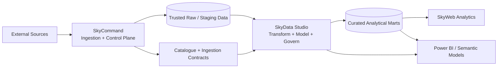

# SkyData Studio

> **Data Engineering Workbench** — transform trusted ingested data into governed, testable, observable analytical products.

SkyData Studio is the post-ingestion data engineering application in the Sky ecosystem. It begins where SkyCommand's ingestion responsibility ends and prepares trusted data for analytical consumption by SkyWeb Analytics, Power BI, and future client-facing applications.

**Current status:** Phase 0/1, Phase 2, and Phase 3 are complete. Phase 4.1 proved the versioned DFF pipeline definition, and Phase 4.2 proved replay-safe local execution with durable run/step evidence and zero physical mutation. Phase 4.3 now attaches the governed SkyCommand observation contract and materializes the Studio-owned Federal Funds Rate Mart with idempotent `MERGE` semantics and row-count evidence.

---

## Phase 2.1 quick start

SkyData Studio consumes SkyCommand through a read-only internal service token. Configure the same local secret in both applications:

```env
# SkyCommand .env
SKYCOMMAND_INTERNAL_API_AUTH_ENABLED=true
SKYCOMMAND_INTERNAL_API_TOKEN=replace_with_a_local_secret

# SkyData Studio .env
SKYCOMMAND_API_BASE_URL=http://localhost:7171/api
SKYCOMMAND_API_AUTH_MODE=internal
SKYCOMMAND_API_TOKEN=replace_with_the_same_local_secret
SKYCOMMAND_OFFLINE_PREVIEW_ENABLED=true
```

The first live workspace is available at `/workspace/assets`. It now includes contract compatibility diagnostics and an asset evidence drawer for quality, revision, rejection, freshness, and run evidence. When SkyCommand is unavailable or the token has not been configured, the API returns an explicitly labelled offline preview rather than silently presenting fixture data as live.

---

## Phase 3.1 quick start

Phase 3.1 adds a Studio-owned PostgreSQL metadata registry. Start and bootstrap it before opening `/workspace/registry`:

```powershell
docker compose -f .\infra\docker-compose.yml up -d studio-postgres
uv run python .\scripts\bootstrap_metadata.py
```

Then start the API and frontend normally. The registry can synchronize the 69 trusted SkyCommand assets into the `RAW` layer and can register portable non-macro products manually. It stores metadata only—connection secrets remain environment references rather than database values.

Core endpoints:

```text
GET   /api/v1/metadata/summary
GET   /api/v1/metadata/assets
GET   /api/v1/metadata/assets/{assetId}
POST  /api/v1/metadata/assets
PATCH /api/v1/metadata/assets/{assetId}/governance
PUT   /api/v1/metadata/assets/{assetId}/fields
GET   /api/v1/metadata/mappings/summary
GET   /api/v1/metadata/mappings
GET   /api/v1/metadata/mappings/{mappingId}
POST  /api/v1/metadata/mappings
POST  /api/v1/metadata/sync/skycommand
```

## Phase 3.2 quick start

After applying Phase 3.2, re-run the idempotent bootstrap so the existing PostgreSQL volume receives the two additive mapping tables:

```powershell
uv run python .\scripts\bootstrap_metadata.py
```

Open `/workspace/mappings` to register a source-to-target product blueprint. Creating a mapping also creates a durable `TRANSFORMS` dependency and can populate the target asset schema from its field-level mapping contract. The Metadata Registry `Inspect` drawer can update ownership, classification, criticality, tags, and target fields for any registered asset.

## Phase 4.1 quick start

Re-run the idempotent bootstrap so the existing PostgreSQL volume receives the additive pipeline-definition tables:

```powershell
uv run python .\scripts\bootstrap_metadata.py
```

Open `/workspace/pipelines`. A READY/ACTIVE source mapping can generate a version-1 local pipeline definition with a `RUN_DATE` parameter and a four-step dependency chain: `READ_SOURCE → TRANSFORM_TARGET → VALIDATE_TARGET → PUBLISH_TARGET`. Phase 4.1 persists the design contract; later phases execute the same graph without changing its versioned design metadata.

## Phase 4.2 quick start

Re-run the idempotent bootstrap so the existing Studio PostgreSQL volume receives the additive run-evidence tables:

```powershell
uv run python .\scripts\bootstrap_metadata.py
```

Use **Run** from `/workspace/pipelines` or open `/orchestration/runs`. A Phase 4.2 proof run resolves the current pipeline version and runtime parameters, derives a deterministic replay key, executes the dependency graph, and persists one structured result per step. Repeating the same logical run reuses the existing durable run by default; `FORCE_NEW` creates an explicit new execution record.

Core endpoints:

```text
GET  /api/v1/pipeline-runs/summary
GET  /api/v1/pipeline-runs
GET  /api/v1/pipeline-runs/{runId}
POST /api/v1/pipeline-runs
```

Phase 4.2 closed with live evidence that replay reuse increments the existing run instead of duplicating step rows, while forced proof runs receive distinct keys. Its structured publish result remained `ELIGIBLE_NOT_PUBLISHED` with `data_mutation_applied=false`, preserving a clean handoff to Phase 4.3.

## Phase 4.3 quick start

Phase 4.3 uses SkyCommand's existing portable `time_series_observations.v1` data-plane contract; SkyData Studio does **not** read SkyCommand implementation tables directly. Keep SkyCommand API/database services available, start the Studio PostgreSQL container, then start the Studio API and web application.

Use **Run** from `/workspace/pipelines`. The local engine now:

1. pages trusted DFF observations from SkyCommand through the governed observation endpoint;
2. applies the registered `OBSERVATION_DATE → OBSERVATION_DATE` and `VALUE → RATE` mapping;
3. validates target fields and the `OBSERVATION_DATE` business key;
4. creates the curated Studio target when needed and applies an idempotent `MERGE`; and
5. records rows read, transformed, inserted, updated, unchanged, rejected, published, changed, and the final target row count.

For the current DFF proof, the physical Studio relation is expected to be:

```text
mart.fed_funds_rate_mart
```

`Replay Safely` reuses the existing durable run and does not execute the materializer again. **Force New Materialization Run** creates a new run and executes the `MERGE` again; when the source has not changed, the second physical run should report zero inserts/updates and all source rows as unchanged. A changed upstream source may legitimately produce inserts or updates while preserving the business-key uniqueness guarantee.

The Phase 4.3 replay key includes the local execution-engine version, so an old Phase 4.2 proof run with the same `RUN_DATE` cannot be accidentally reused as a materialized run.

---

## Validation contract

Run the complete local validation suite before every SkyCommand development promotion:

```powershell
python .\scripts\validate.py
```

The first run creates `uv.lock` and `apps/web/package-lock.json`. Commit both lockfiles. Later runs use locked Python synchronization and `npm ci`, matching GitHub Actions as closely as possible. On Windows, the runner automatically uses uv copy mode to avoid Dropbox-incompatible hard links. Pytest is launched with `python -m pytest` so Windows App Control policies that block generated console launchers such as `pytest.exe` do not prevent validation. The runner also refuses to run while the API or Vite development server is active because dependency synchronization rebuilds local environments. The suite performs Python compilation, Ruff, mypy, pytest, ESLint, and a Vite production build.

---

## Product position

The Sky ecosystem now separates three distinct responsibilities:

| Product | Primary responsibility | Core orchestration |
|---|---|---|
| **SkyCommand** | Ingestion, operational automation, tools, workflows, users, APIs, databases, and runtime observability | Temporal |
| **SkyData Studio** | ETL/ELT, transformation, modelling, quality, lineage, Airflow orchestration, analytical marts, and reporting delivery | Apache Airflow |
| **SkyWeb Analytics** | Macro-economic exploration, visual storytelling, alerts, and client-facing analytical experiences | Consumer application |

SkyData Studio does **not** own source ingestion. It consumes versioned contracts and trusted raw/staging assets produced by SkyCommand.



---

## Guiding principles

1. **Clean product boundaries.** SkyCommand controls ingestion; SkyData Studio controls post-ingestion engineering; SkyWeb consumes curated analytical products.
2. **Contracts before coupling.** Integration uses versioned APIs, contracts, assets, and read-only database views—not direct dependence on another application's internals.
3. **Airflow for batch data workflows.** Temporal remains SkyCommand's durable application-workflow engine. Airflow owns dependency-aware analytical pipelines, backfills, data assets, schedules, and batch observability.
4. **SQL-first, Python-capable.** Transformations should remain transparent and testable in SQL where practical, with Python for complex processing and reusable engineering components.
5. **Metadata is a product.** Assets, owners, dependencies, quality evidence, lineage, freshness, and run history are first-class application surfaces.
6. **Portfolio-grade engineering.** Every phase should produce demonstrable architecture, tests, documentation, and operational proof.
7. **Reusable architecture.** Macro-economic data is the first domain, not a permanent limitation.

---

## Planned technology stack

| Layer | Technology | Purpose |
|---|---|---|
| Backend | Python 3.12 + FastAPI + Pydantic | Typed APIs, configuration, service integration, metadata services |
| Frontend | React 19 + Vite + React Router | Studio workbench and observability UI |
| Operational database | PostgreSQL | Studio metadata, configuration, run evidence, catalogue extensions |
| Transformation | dbt Core + PostgreSQL | Staging, intermediate, mart, tests, documentation, lineage artifacts |
| Orchestration | Apache Airflow 3 | DAGs, asset-aware scheduling, backfills, retries, dependencies, batch monitoring |
| Data processing | SQLAlchemy, SQL, Python; Polars/Pandas when justified | Reusable ETL/ELT components |
| Quality | dbt tests + contract validation; dedicated quality framework later | Layered data assurance |
| Visualization | Apache ECharts / D3 where useful | Pipeline, quality, lineage, and model observability |
| Reporting | Power BI in a later phase | Semantic models, governed measures, executive reporting |
| Tooling | uv, Ruff, mypy, pytest, Playwright, GitHub Actions | Reproducibility and automated validation |

Airflow is intentionally isolated from the main API environment. On Windows development machines, Airflow will run through WSL2 or Linux containers.

---

## Application experience

SkyData Studio keeps the proven SkyCommand workbench layout:

- fixed left sidebar;
- accordion-style menu groups;
- top command/search bar;
- dashboard-first navigation;
- reusable panels, status pills, stat cards, overlays, and full-screen charts;
- table-first operational detail with visual summaries above it.

It introduces a separate **Aurora Foundry** theme:

- deep ink/navy surfaces;
- teal and mint for trusted data movement;
- violet for transformation and modelling;
- amber for quality warnings and review states;
- coral/red for failed checks and blocked pipelines.

Initial navigation model:

```text
Dashboards
  └─ Studio Overview

Data Workspace
  ├─ Data Assets
  ├─ Metadata Registry
  ├─ Pipelines
  ├─ Transformations
  └─ Data Models

Orchestration
  ├─ Airflow
  ├─ Pipeline Runs
  └─ Schedules & Backfills

Quality & Lineage
  ├─ Data Quality
  ├─ Contracts
  └─ Lineage

Analytics Delivery
  ├─ Analytical Marts
  ├─ Semantic Layer
  ├─ Reports
  └─ Power BI

Configuration
  ├─ Connections
  ├─ Environments
  └─ Settings
```

---

# Implementation roadmap

The roadmap is directional rather than rigid. Each phase closes with tests, working UI proof, documentation, and a repository handoff.

## Phase 0 — Repository and architecture foundation

**Goal:** establish SkyData Studio as a separate, reproducible product.

Deliverables:

- public repository named `SkyDataStudio`;
- `main` as stable/reviewed and `dev` as the active integration branch;
- Python `uv` project and React/Vite application structure;
- `.env.example`, formatting, linting, test, and validation commands;
- architecture, design-system, integration-contract, and roadmap documentation;
- repository map and compact ZIP utilities;
- GitHub Actions baseline for backend and frontend validation.

**Exit proof:** clean checkout can install, run the API, run the UI, and execute validation commands.

## Phase 1 — Studio shell and platform health

**Goal:** deliver the branded application shell and prove the Python full-stack foundation.

Deliverables:

- FastAPI service with `/api/v1/health` and platform-summary endpoints;
- React workbench with accordion sidebar and Aurora Foundry theme;
- Studio Overview dashboard showing platform capabilities and integration boundaries;
- environment-aware configuration and CORS;
- reusable UI primitives and responsive behavior;
- initial backend tests and frontend build validation.

**Exit proof:** the dashboard loads live capability data from FastAPI and clearly represents SkyCommand, Airflow, dbt, warehouse, and reporting status.

## Phase 2 — SkyCommand data-contract bridge

**Goal:** consume SkyCommand outputs without duplicating ingestion responsibilities.

Deliverables:

- typed clients for `data_catalogue.v1`, `data_asset.v1`, `data_freshness_status.v1`, `ingestion_run_summary.v1`, and `ingestion_quality_evidence.v1`;
- API-token and read-only database connection profiles;
- contract compatibility checks and version negotiation;
- asset discovery and ingestion-run import/synchronization;
- ingestion-complete handoff design;
- boundary dashboard showing source assets available for downstream processing.

**Exit proof:** SkyData Studio can discover trusted assets and ingest run evidence from a live SkyCommand environment without querying SkyCommand implementation tables directly.

## Phase 3 — Data catalogue and engineering metadata

**Goal:** create the Studio's internal representation of post-ingestion data products.

Deliverables:

- domains, systems, connections, namespaces, assets, fields, owners, tags, classifications, and dependencies;
- raw, staging, intermediate, mart, semantic, and report layers;
- source-to-target mapping specifications;
- asset detail pages with freshness, schema, quality, lineage, and run summaries;
- metadata migrations and administration APIs;
- reusable non-macro domain proof.

**Exit proof:** an engineer can register and inspect a complete data product from source asset to intended analytical mart.

## Phase 4 — ETL/ELT pipeline workbench

**Goal:** define and execute reusable post-ingestion processing pipelines.

Deliverables:

- pipeline definitions, versions, parameters, steps, dependencies, and environments;
- SQL, Python, validation, dbt, and publish step types;
- incremental-load strategies, watermarks, idempotency, and replay controls;
- execution context and structured step-result contracts;
- create/manage/run/history user interfaces;
- local execution engine for development and focused tests.

**Exit proof:** one macro pipeline transforms a trusted SkyCommand asset into a curated table with repeatable run evidence.

## Phase 5 — Apache Airflow integration

**Goal:** make Airflow the durable batch orchestrator for Studio pipelines.

Deliverables:

- Airflow 3 local container stack;
- Task SDK-based DAG authoring conventions;
- stable Airflow REST API client—no direct metadata-database reads;
- DAG catalogue, run history, task details, logs, retries, backfills, and cancellation controls;
- time-based, asset-aware, and event-driven scheduling patterns;
- SkyCommand ingestion-complete asset event or API trigger;
- Studio pipeline-to-DAG generation or registration strategy.

**Exit proof:** a SkyCommand ingestion completion causes the appropriate Airflow pipeline to run, with status visible in SkyData Studio.

## Phase 6 — dbt transformation and modelling foundation

**Goal:** make analytical modelling explicit, tested, documented, and version-controlled.

Deliverables:

- dbt project structure for `sources`, `staging`, `intermediate`, and `marts`;
- naming, materialization, schema, and incremental-model standards;
- source freshness, generic tests, singular tests, and model contracts;
- dbt run/test/build integration inside Airflow;
- manifest and run-results artifact ingestion;
- model catalogue and documentation surfaces in the Studio UI.

**Exit proof:** the macro domain has a tested dimensional model and dbt artifacts are visible in Studio.

## Phase 7 — Data quality, reconciliation, and observability

**Goal:** detect bad data before it reaches consumers and explain every decision.

Deliverables:

- layered checks: contract, schema, completeness, uniqueness, validity, referential integrity, reconciliation, freshness, and anomaly detection;
- severity, blocking policy, ownership, waivers, and issue lifecycle;
- row-count and aggregate reconciliation between pipeline layers;
- quality scorecards, incident detail, failed-row samples, and trend charts;
- alert integration with SkyCommand workflows where operational action is required;
- service-level objectives for critical data products.

**Exit proof:** failed blocking checks prevent mart publication and create durable, actionable evidence.

## Phase 8 — Lineage and impact analysis

**Goal:** show how data moves and what a change could break.

Deliverables:

- asset-, field-, model-, pipeline-, report-, and metric-level lineage;
- lineage ingestion from dbt artifacts and Airflow assets;
- visual dependency graph with upstream/downstream traversal;
- change impact analysis for schema and model revisions;
- ownership and incident overlays;
- optional OpenLineage-compatible event seam.

**Exit proof:** selecting a Power BI measure or SkyWeb metric reveals its path back to the ingested source asset.

## Phase 9 — Analytical marts and semantic delivery

**Goal:** publish stable, consumer-ready analytical products.

Deliverables:

- dimensional modelling standards and conformed dimensions;
- macro-economic fact/dimension marts;
- governed metric definitions and semantic metadata;
- versioned consumer views/APIs for SkyWeb;
- performance tuning, indexing, partitioning, and caching evidence;
- data-product release and deprecation workflow.

**Exit proof:** SkyWeb reads curated marts/contracts rather than assembling analytical logic from ingestion tables.

## Phase 10 — Power BI integration and reporting studio

**Goal:** add enterprise reporting skills without turning Power BI into the system of record.

Deliverables:

- Power BI-friendly star schemas and certified views;
- semantic model and measure catalogue;
- connection, refresh, gateway, and environment strategy;
- report inventory, ownership, dependencies, and refresh status;
- first executive macro-economic report;
- deployment-pipeline and version-control strategy where supported.

**Exit proof:** a governed Power BI report refreshes from Studio marts and its lineage/quality status is visible in SkyData Studio.

## Phase 11 — Security, governance, and environment promotion

**Goal:** harden the platform for multi-user and production-like operation.

Deliverables:

- authentication and role-based access;
- secrets and connection governance;
- development/test/production environment profiles;
- promotion approvals and release evidence;
- audit history and sensitive-data classifications;
- backup, recovery, retention, and disaster-recovery procedures.

**Exit proof:** a versioned data product can be promoted from dev to test to production with approvals and an auditable trail.

## Phase 12 — AI-assisted data engineering

**Goal:** use AI as an accelerator while retaining deterministic controls.

Deliverables:

- assisted mapping, SQL generation, test generation, documentation, and incident summaries;
- retrieval over approved catalogue and lineage metadata;
- explain-before-apply workflow for generated changes;
- automated validation and human approval gates;
- evaluation suite for correctness, safety, and hallucination resistance.

**Exit proof:** an engineer can propose a transformation through AI assistance, inspect the plan/diff/tests, and promote only validated changes.

## Phase 13 — Portfolio closure and reusable domain proof

**Goal:** demonstrate that the platform is a reusable data-engineering system, not a macro-only demo.

Deliverables:

- complete architecture and operating documentation;
- automated test and release pipeline;
- macro end-to-end reference implementation;
- second-domain portability proof;
- polished demo script and interview discussion guide;
- performance, reliability, and quality evidence.

**Exit proof:** the application demonstrates ingestion handoff, ETL, Airflow, dbt, quality, lineage, analytical marts, SkyWeb consumption, and Power BI delivery end to end.

---

## Initial repository structure

```text
SkyDataStudio/
├─ apps/
│  ├─ api/                       # FastAPI application
│  └─ web/                       # React workbench
├─ packages/
│  └─ contracts/                 # Typed cross-product contracts
├─ orchestration/
│  └─ airflow/dags/              # Airflow Task SDK DAGs
├─ transformations/
│  └─ dbt/skydata_studio/        # dbt project
├─ contracts/
│  └─ skycommand/                # Integration contract documentation
├─ docs/                         # Architecture, design, and roadmap detail
├─ infra/                        # Local PostgreSQL and future Airflow containers
├─ scripts/                      # Validation, repo map, and handoff packaging
└─ tests/                        # Backend and contract tests
```

---

## Local development

### Prerequisites

- Git
- Python 3.12
- [uv](https://docs.astral.sh/uv/)
- Node.js 22+
- PostgreSQL 16 or 17
- Docker Desktop + WSL2 for the later Airflow stack on Windows

### Backend

```powershell
uv sync --dev
uv run uvicorn skydata_studio.main:app --app-dir apps/api --reload --port 8100
```

API documentation: `http://localhost:8100/docs`

### Frontend

```powershell
cd apps/web
npm install
npm run dev
```

Frontend: `http://localhost:5174`

### Validation

```powershell
uv run python scripts/validate.py
```

---

## Branch strategy

```text
main  = stable, reviewed, demonstrable releases
dev   = active integration branch
feature/* = optional isolated work for larger phases
```

Normal flow:

```text
feature work → dev → validation/demo → pull request → main
```

---

## Current implementation slice

The initial scaffold already includes:

- FastAPI health, platform summary, roadmap, and contract-boundary endpoints;
- typed SkyCommand ingestion contract models;
- React accordion-sidebar workbench;
- Aurora Foundry theme and Studio Overview page;
- dbt project skeleton;
- Airflow Task SDK smoke DAG;
- PostgreSQL local container;
- backend tests and repository validation tooling.

The next implementation target is **Phase 2: SkyCommand data-contract bridge**, starting with a read-only client for the generic Phase 16 catalogue and ingestion-run APIs.
