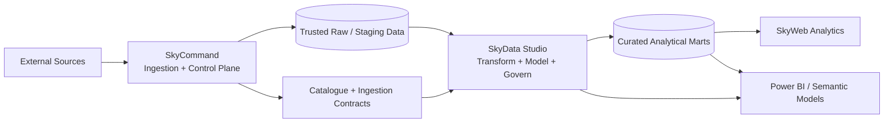

# SkyData Studio

> **Data Engineering Workbench** — transform trusted ingested data into governed, testable, observable analytical products.

SkyData Studio is the post-ingestion data engineering application in the Sky ecosystem. It begins where SkyCommand's ingestion responsibility ends and prepares trusted data for analytical consumption by SkyWeb Analytics, Power BI, and future client-facing applications.

**Current status:** Phases 0 through 7 are complete. Phase 7 closed with TRUSTED dbt quality evidence, a COMPLIANT 5/5 consumer gate, durable incident reconciliation, and a 30-day/99% quality SLO reporting MEETING at 100% observed compliance; the final Phase 7.4 validation passed 72 tests. **Phase 8.1 is now in progress:** Studio metadata mappings, dbt dependencies, semantic models, and governed metrics are stitched into one federated lineage graph with transitive downstream impact analysis.

---

## Phase 2.1 quick start

SkyData Studio consumes SkyCommand through a read-only internal service token. Configure the same local secret in both applications:

```env
# SkyCommand .env
SKYCOMMAND_INTERNAL_API_AUTH_ENABLED=true
SKYCOMMAND_INTERNAL_API_TOKEN=replace_with_a_local_secret

# SkyData Studio .env
SKYCOMMAND_API_BASE_URL=http://localhost:7171/api
SKYCOMMAND_API_AUTH_MODE=internal
SKYCOMMAND_API_TOKEN=replace_with_the_same_local_secret
SKYCOMMAND_OFFLINE_PREVIEW_ENABLED=true
```

The first live workspace is available at `/workspace/assets`. It now includes contract compatibility diagnostics and an asset evidence drawer for quality, revision, rejection, freshness, and run evidence. When SkyCommand is unavailable or the token has not been configured, the API returns an explicitly labelled offline preview rather than silently presenting fixture data as live.

---

## Phase 3.1 quick start

Phase 3.1 adds a Studio-owned PostgreSQL metadata registry. Start and bootstrap it before opening `/workspace/registry`:

```powershell
docker compose -f .\infra\docker-compose.yml up -d studio-postgres
uv run python .\scripts\bootstrap_metadata.py
```

Then start the API and frontend normally. The registry can synchronize the 69 trusted SkyCommand assets into the `RAW` layer and can register portable non-macro products manually. It stores metadata only—connection secrets remain environment references rather than database values.

Core endpoints:

```text
GET   /api/v1/metadata/summary
GET   /api/v1/metadata/assets
GET   /api/v1/metadata/assets/{assetId}
POST  /api/v1/metadata/assets
PATCH /api/v1/metadata/assets/{assetId}/governance
PUT   /api/v1/metadata/assets/{assetId}/fields
GET   /api/v1/metadata/mappings/summary
GET   /api/v1/metadata/mappings
GET   /api/v1/metadata/mappings/{mappingId}
POST  /api/v1/metadata/mappings
POST  /api/v1/metadata/sync/skycommand
```

## Phase 3.2 quick start

After applying Phase 3.2, re-run the idempotent bootstrap so the existing PostgreSQL volume receives the two additive mapping tables:

```powershell
uv run python .\scripts\bootstrap_metadata.py
```

Open `/workspace/mappings` to register a source-to-target product blueprint. Creating a mapping also creates a durable `TRANSFORMS` dependency and can populate the target asset schema from its field-level mapping contract. The Metadata Registry `Inspect` drawer can update ownership, classification, criticality, tags, and target fields for any registered asset.

## Phase 4.1 quick start

Re-run the idempotent bootstrap so the existing PostgreSQL volume receives the additive pipeline-definition tables:

```powershell
uv run python .\scripts\bootstrap_metadata.py
```

Open `/workspace/pipelines`. A READY/ACTIVE source mapping can generate a version-1 local pipeline definition with a `RUN_DATE` parameter and a four-step dependency chain: `READ_SOURCE → TRANSFORM_TARGET → VALIDATE_TARGET → PUBLISH_TARGET`. Phase 4.1 persists the design contract; later phases execute the same graph without changing its versioned design metadata.

## Phase 4.2 quick start

Re-run the idempotent bootstrap so the existing Studio PostgreSQL volume receives the additive run-evidence tables:

```powershell
uv run python .\scripts\bootstrap_metadata.py
```

Use **Run** from `/workspace/pipelines` or open `/orchestration/runs`. A Phase 4.2 proof run resolves the current pipeline version and runtime parameters, derives a deterministic replay key, executes the dependency graph, and persists one structured result per step. Repeating the same logical run reuses the existing durable run by default; `FORCE_NEW` creates an explicit new execution record.

Core endpoints:

```text
GET  /api/v1/pipeline-runs/summary
GET  /api/v1/pipeline-runs
GET  /api/v1/pipeline-runs/{runId}
POST /api/v1/pipeline-runs
```

Phase 4.2 closed with live evidence that replay reuse increments the existing run instead of duplicating step rows, while forced proof runs receive distinct keys. Its structured publish result remained `ELIGIBLE_NOT_PUBLISHED` with `data_mutation_applied=false`, preserving a clean handoff to Phase 4.3.

## Phase 4.3 quick start

Phase 4.3 uses SkyCommand's existing portable `time_series_observations.v1` data-plane contract; SkyData Studio does **not** read SkyCommand implementation tables directly. Keep SkyCommand API/database services available, start the Studio PostgreSQL container, then start the Studio API and web application.

Use **Run** from `/workspace/pipelines`. The local engine now:

1. pages trusted DFF observations from SkyCommand through the governed observation endpoint;
2. applies the registered `OBSERVATION_DATE → OBSERVATION_DATE` and `VALUE → RATE` mapping;
3. validates target fields and the `OBSERVATION_DATE` business key;
4. creates the curated Studio target when needed and applies an idempotent `MERGE`; and
5. records rows read, transformed, inserted, updated, unchanged, rejected, published, changed, and the final target row count.

For the current DFF proof, the physical Studio relation is expected to be:

```text
mart.fed_funds_rate
```

`Replay Safely` reuses the existing durable run and does not execute the materializer again. **Force New Materialization Run** creates a new run and executes the `MERGE` again; when the source has not changed, the second physical run should report zero inserts/updates and all source rows as unchanged. A changed upstream source may legitimately produce inserts or updates while preserving the business-key uniqueness guarantee.

The Phase 4.3 replay key includes the local execution-engine version, so an old Phase 4.2 proof run with the same `RUN_DATE` cannot be accidentally reused as a materialized run.

## Phase 5.1 quick start

Phase 5.1 introduces an isolated Apache Airflow 3.3 runtime. Airflow owns its own metadata PostgreSQL database; SkyData Studio observes it only through the stable public REST API v2. The local development stack uses Airflow's SimpleAuthManager all-admin mode so the Studio backend can acquire a development JWT without storing credentials.

Initialize Airflow once, then start its long-running services:

```powershell
docker compose -f .\infra\docker-compose.yml up airflow-init
docker compose -f .\infra\docker-compose.yml up -d airflow-api-server airflow-scheduler airflow-dag-processor airflow-triggerer
docker compose -f .\infra\docker-compose.yml ps
```

Airflow UI: `http://localhost:8080`

Open `/orchestration/airflow` in SkyData Studio. The page reads `/api/v2/monitor/health` and the DAG catalogue through the Studio backend and should show the metadata database, scheduler, DAG processor, triggerer, and `skydata_studio_platform_smoke` DAG. No Airflow metadata tables are queried directly.

## Phase 5.3 quick start

Phase 5.3 turns the proven DFF DAG into a daily time-based workflow and adds controlled backfill creation through Airflow REST API v2. Scheduled and backfill runs derive `RUN_DATE` from the Airflow data interval; manual runs may still provide an explicit date. The Studio API limits local proof backfills to seven calendar days and at most three concurrent runs, with missing-runs-only reprocessing as the safe default.

## Phase 5.4 quick start

Phase 5.4 adds a native Airflow asset event at `x-skycommand://ingestion/macro/dff`. The DFF DAG keeps its daily timetable through an asset-or-time schedule. SkyData Studio resolves terminal successful FRED/DFF ingestion evidence through SkyCommand's read-only API, emits one Airflow asset event through REST API v2, and deduplicates repeated signals for the same ingestion run. Open `/orchestration/airflow` and use **Emit Ingestion Event** to run the proof.

Open `/orchestration/backfills` after Airflow has reparsed the DAG. The DFF timetable should be visible there, together with the controlled backfill form and Airflow-owned backfill history. The first proof should use a one-day window and `max_active_runs = 1`.

## Phase 6 quick start

Phase 6 keeps dbt outside the FastAPI environment and runs it ephemerally through Docker Compose against Studio PostgreSQL. Build the runtime once, then use the helper for debug/build operations:

```powershell
docker compose -f .\infra\docker-compose.yml build dbt
Unblock-File .\scripts\dbt.ps1  # only when Windows marks the trusted local helper as downloaded
.\scripts\dbt.ps1 debug
.\scripts\dbt.ps1 build
```

Phase 6.1 materializes the proven `stg_fed_funds_rate → int_fed_funds_rate_changes → fct_fed_funds_rate_daily` chain. Open `/workspace/transformations` for physical relation readiness and row-count proof. Phase 6.2 reads the generated `target/manifest.json` and `target/run_results.json` artifacts through `GET /api/v1/transformations/dbt/models`; open `/workspace/models` to inspect model layers, materializations, tests, columns, tags, and direct dependencies. Phase 6.3 adds model-embedded semantic definitions to the governed mart, a dedicated DAY-grain MetricFlow time spine, and projects semantic evidence through `GET /api/v1/transformations/dbt/semantic`; open `/delivery/semantic` to inspect the semantic model, primary entity, dimensions, and governed metrics. Generated dbt artifacts remain ignored by Git and are refreshed by the next dbt build.

## Phase 7.1 quick start

Phase 7.1 keeps dbt as the test-definition and execution authority, then joins `manifest.json` test metadata with `run_results.json` outcomes through `GET /api/v1/quality/dbt/summary`. Open `/quality/checks` to inspect the latest trust posture, layer coverage, test dimensions, severity, failures, and runtime evidence. This first quality slice is observational only; persistent incidents, blocking policies, reconciliation rules, and SLOs remain later Phase 7 boundaries.

## Phase 7.2 quick start

Phase 7.2 adds the first source-controlled consumer quality gate under `contracts/quality/fed_funds_rate_daily.v1.json`. The policy does not copy dbt test definitions; instead, stable selectors such as target model, quality dimension, test kind, and column are evaluated against the latest Phase 7.1 dbt evidence.

Core endpoint:

```text
GET /api/v1/quality/contracts/summary
```

Open `/quality/contracts` to inspect the mart gate and the existing SkyCommand consumer compatibility boundary together. The Federal Funds Rate proof requires five passing MART checks and a 100% pass rate. A missing or non-passing required rule blocks the contract; missing latest run evidence leaves it `PENDING`. Phase 7.2 closed with the live gate COMPLIANT at 5/5 and all five SkyCommand consumer contracts COMPATIBLE.


## Phase 7.3 quick start

Phase 7.3 adds Studio-owned runtime persistence for quality incidents without copying dbt test definitions or source-controlled contract policy. Re-run the idempotent PostgreSQL bootstrap so the two incident tables are created:

```powershell
docker compose -f .\infra\docker-compose.yml up -d studio-postgres
uv run python .\scripts\bootstrap_metadata.py
```

Then reconcile the current contract evidence into the durable register:

```text
GET  /api/v1/quality/incidents/summary
POST /api/v1/quality/incidents/reconcile
POST /api/v1/quality/incidents/{incidentId}/acknowledge
POST /api/v1/quality/incidents/{incidentId}/resolve
```

Open `/quality/incidents`. A clean 5/5 contract intentionally creates **zero** incidents. `WARN`, `BLOCK`, or `MISSING` rule outcomes create one durable incident per contract rule; operators can acknowledge and manually resolve it, PASS evidence auto-resolves it, and a later recurrence reopens the same record while preserving event history. Manual resolution is not a waiver: reconciliation reopens an incident if failing evidence remains.

---

## Phase 7.4 quick start

Phase 7.4 adds an observation-backed quality SLO without pretending local captures are continuous uptime. The Federal Funds Rate quality contract now owns a 30-day, 99% minimum compliant-observation target. Re-run the idempotent metadata bootstrap so `quality_slo_observation` exists:

```powershell
docker compose -f .\infra\docker-compose.yml up -d studio-postgres
uv run python .\scripts\bootstrap_metadata.py
```

Capture the latest quality evidence. This also reconciles durable incidents first, then writes **at most one** reliability observation for the current dbt invocation:

```powershell
Invoke-RestMethod `
  -Method Post `
  "http://localhost:8100/api/v1/quality/reliability/capture" |
  ConvertTo-Json -Depth 12
```

With the current clean Federal Funds Rate evidence, the first capture should report `observation_created=true`; repeating the same capture should return `false` because the dbt invocation is already represented. Inspect the rolling posture with:

```powershell
Invoke-RestMethod `
  "http://localhost:8100/api/v1/quality/reliability/summary" |
  ConvertTo-Json -Depth 12
```

The first clean proof should show `MEETING`, 100% observed compliance, a 99% target, one observation, zero blocked observations, and a compliant streak of one. Open **Quality & Lineage → Reliability** for the same evidence in the workbench.

---

## Phase 8.1 quick start

Phase 8.1 composes a read-only lineage graph from existing authorities rather than creating another lineage metadata store. The first proof joins the READY `DFF → FED_FUNDS_RATE_MART` Studio mapping to the dbt source/model DAG and then continues through the semantic model into all governed metrics.

Start Studio PostgreSQL and ensure the current dbt artifacts exist, then inspect the graph:

```powershell
Invoke-RestMethod `
  "http://localhost:8100/api/v1/lineage/summary" |
  ConvertTo-Json -Depth 12
```

The current Federal Funds Rate proof should report one metadata mapping, 3 dbt business models, 1 semantic model, 4 metrics, 11 total nodes, and 10 directed edges. The default impact radius begins at `DFF` and should reach 10 downstream nodes including all 3 dbt models, the semantic model, and all 4 governed metrics.

Open **Quality & Lineage → Lineage** and select any node to recompute its transitive downstream radius. You can query the same impact directly with `GET /api/v1/lineage/impact?nodeId=...`. Phase 8.1 remains a federated read model: field-level lineage, quality overlays, and report/consumer impact stay in later Phase 8 slices.

## Validation contract

Run the complete local validation suite before every SkyData Studio development promotion:

```powershell
python .\scripts\validate.py
```

The first run creates `uv.lock` and `apps/web/package-lock.json`. Commit both lockfiles. Later runs use locked Python synchronization and `npm ci`, matching GitHub Actions as closely as possible. On Windows, the runner automatically uses uv copy mode to avoid Dropbox-incompatible hard links. Pytest is launched with `python -m pytest` so Windows App Control policies that block generated console launchers such as `pytest.exe` do not prevent validation. The runner also refuses to run while the API or Vite development server is active because dependency synchronization rebuilds local environments. The suite performs Python compilation, Ruff, mypy, pytest, ESLint, and a Vite production build.

---

## Product position

The Sky ecosystem now separates three distinct responsibilities:

| Product | Primary responsibility | Core orchestration |
|---|---|---|
| **SkyCommand** | Ingestion, operational automation, tools, workflows, users, APIs, databases, and runtime observability | Temporal |
| **SkyData Studio** | ETL/ELT, transformation, modelling, quality, lineage, Airflow orchestration, analytical marts, and reporting delivery | Apache Airflow |
| **SkyWeb Analytics** | Macro-economic exploration, visual storytelling, alerts, and client-facing analytical experiences | Consumer application |

SkyData Studio does **not** own source ingestion. It consumes versioned contracts and trusted raw/staging assets produced by SkyCommand.



---

## Guiding principles

1. **Clean product boundaries.** SkyCommand controls ingestion; SkyData Studio controls post-ingestion engineering; SkyWeb consumes curated analytical products.
2. **Contracts before coupling.** Integration uses versioned APIs, contracts, assets, and read-only database views—not direct dependence on another application's internals.
3. **Airflow for batch data workflows.** Temporal remains SkyCommand's durable application-workflow engine. Airflow owns dependency-aware analytical pipelines, backfills, data assets, schedules, and batch observability.
4. **SQL-first, Python-capable.** Transformations should remain transparent and testable in SQL where practical, with Python for complex processing and reusable engineering components.
5. **Metadata is a product.** Assets, owners, dependencies, quality evidence, lineage, freshness, and run history are first-class application surfaces.
6. **Portfolio-grade engineering.** Every phase should produce demonstrable architecture, tests, documentation, and operational proof.
7. **Reusable architecture.** Macro-economic data is the first domain, not a permanent limitation.

---

## Planned technology stack

| Layer | Technology | Purpose |
|---|---|---|
| Backend | Python 3.12 + FastAPI + Pydantic | Typed APIs, configuration, service integration, metadata services |
| Frontend | React 19 + Vite + React Router | Studio workbench and observability UI |
| Operational database | PostgreSQL | Studio metadata, configuration, run evidence, catalogue extensions |
| Transformation | dbt Core + PostgreSQL | Staging, intermediate, mart, tests, documentation, lineage artifacts |
| Orchestration | Apache Airflow 3 | DAGs, asset-aware scheduling, backfills, retries, dependencies, batch monitoring |
| Data processing | SQLAlchemy, SQL, Python; Polars/Pandas when justified | Reusable ETL/ELT components |
| Quality | dbt tests + contract validation; dedicated quality framework later | Layered data assurance |
| Visualization | Apache ECharts / D3 where useful | Pipeline, quality, lineage, and model observability |
| Reporting | Power BI in a later phase | Semantic models, governed measures, executive reporting |
| Tooling | uv, Ruff, mypy, pytest, Playwright, GitHub Actions | Reproducibility and automated validation |

Airflow is intentionally isolated from the main API environment. On Windows development machines, Airflow will run through WSL2 or Linux containers.

---

## Application experience

SkyData Studio keeps the proven SkyCommand workbench layout:

- fixed left sidebar;
- accordion-style menu groups;
- top command/search bar;
- dashboard-first navigation;
- reusable panels, status pills, stat cards, overlays, and full-screen charts;
- table-first operational detail with visual summaries above it.

It introduces a separate **Aurora Foundry** theme:

- deep ink/navy surfaces;
- teal and mint for trusted data movement;
- violet for transformation and modelling;
- amber for quality warnings and review states;
- coral/red for failed checks and blocked pipelines.

Initial navigation model:

```text
Dashboards
  └─ Studio Overview

Data Workspace
  ├─ Data Assets
  ├─ Metadata Registry
  ├─ Pipelines
  ├─ Transformations
  └─ Data Models

Orchestration
  ├─ Airflow
  ├─ Pipeline Runs
  └─ Schedules & Backfills

Quality & Lineage
  ├─ Data Quality
  ├─ Contracts
  ├─ Quality Incidents
  ├─ Reliability
  └─ Lineage

Analytics Delivery
  ├─ Analytical Marts
  ├─ Semantic Layer
  ├─ Reports
  └─ Power BI

Configuration
  ├─ Connections
  ├─ Environments
  └─ Settings
```

---

# Implementation roadmap

The public roadmap is intentionally compact so GitHub visitors can see progress at a glance. Detailed phase decisions, acceptance evidence, and closure notes live in [`docs/ROADMAP.md`](docs/ROADMAP.md).

| Phase | Status | Objective |
| --- | --- | --- |
| Phase 0 | ✅ Complete | Repository, architecture, validation, documentation, and promotion foundation |
| Phase 1 | ✅ Complete | Branded FastAPI + React Studio shell, platform health, and Aurora Foundry design system |
| Phase 2 | ✅ Complete | Read-only SkyCommand contract bridge, live asset discovery, compatibility, freshness, and quality evidence |
| Phase 3 | ✅ Complete | Studio-owned metadata registry, governance, source-to-target mappings, target schemas, and lineage dependencies |
| Phase 4 | ✅ Complete | Versioned ETL/ELT pipeline workbench, replay-safe local execution, structured run evidence, and idempotent curated-table materialization |
| Phase 5 | ✅ Complete | Apache Airflow 3 durable batch orchestration, REST API v2 integration, DAG/run/task observability, schedules, backfills, and ingestion-complete triggers |
| Phase 6 | ✅ Complete | dbt transformation and modelling foundation with tested staging, intermediate, mart, and semantic layers |
| Phase 7 | ✅ Complete | Data quality, reconciliation, blocking policies, incidents, SLOs, and observability |
| Phase 8 | 🔄 In Progress | Asset/field/model/report lineage and downstream impact analysis |
| Phase 9 | ⏳ Planned | Curated analytical marts, governed metrics, semantic delivery, and SkyWeb consumer contracts |
| Phase 10 | ⏳ Planned | Power BI semantic models, refresh strategy, reporting inventory, and governed executive delivery |
| Phase 11 | ⏳ Planned | Security, RBAC, environment promotion, audit evidence, backup, recovery, and retention |
| Phase 12 | ⏳ Planned | AI-assisted mapping, SQL, tests, documentation, and explain-before-apply engineering workflows |
| Phase 13 | ⏳ Planned | Portfolio closure, second-domain portability proof, polished demo, and end-to-end operating evidence |
| Continuous | 🔄 Ongoing | Expand tests, contracts, documentation, reusable domain seams, UI polish, and operational proof |

## Initial repository structure

```text
SkyDataStudio/
├─ apps/
│  ├─ api/                       # FastAPI application
│  └─ web/                       # React workbench
├─ packages/
│  └─ contracts/                 # Typed cross-product contracts
├─ orchestration/
│  └─ airflow/dags/              # Airflow Task SDK DAGs
├─ transformations/
│  └─ dbt/skydata_studio/        # dbt project
├─ contracts/
│  └─ skycommand/                # Integration contract documentation
├─ docs/                         # Architecture, design, and roadmap detail
├─ infra/                        # Studio PostgreSQL and local Airflow containers
├─ scripts/                      # Validation, repo map, and handoff packaging
└─ tests/                        # Backend and contract tests
```

---

## Local development

### Prerequisites

- Git
- Python 3.12
- [uv](https://docs.astral.sh/uv/)
- Node.js 22+
- PostgreSQL 16 or 17
- Docker Desktop with the WSL2 backend for the local Airflow stack on Windows

### Backend

```powershell
uv sync --dev
uv run uvicorn skydata_studio.main:app --app-dir apps/api --reload --port 8100
```

API documentation: `http://localhost:8100/docs`

For the Phase 5.2 Airflow callback proof, Airflow runs inside Docker and must be able to reach the host-side Studio API. Start the backend on all local interfaces for that proof:

```powershell
uv run uvicorn skydata_studio.main:app --app-dir apps/api --reload --host 0.0.0.0 --port 8100
```

Docker resolves the host through `host.docker.internal`; the callback URL is controlled by `AIRFLOW_STUDIO_API_BASE_URL`. Keep this development-only binding behind the local firewall.

### Frontend

```powershell
cd apps/web
npm install
npm run dev
```

Frontend: `http://localhost:5174`

### Validation

```powershell
uv run python scripts/validate.py
```

---

## Branch strategy

```text
main  = stable, reviewed, demonstrable releases
dev   = active integration branch
feature/* = optional isolated work for larger phases
```

Normal flow:

```text
feature work → dev → validation/demo → pull request → main
```

---

## Current implementation slice

The repository currently includes:

- live SkyCommand contract discovery, compatibility, freshness, quality, and observation access;
- a Studio-owned PostgreSQL metadata registry with governed source-to-target mappings;
- versioned ETL/ELT pipeline definitions, replay-safe local execution, and durable step evidence;
- proven idempotent materialization of the Federal Funds Rate Mart in `mart.fed_funds_rate`;
- an isolated Airflow 3.3 local stack with API server, scheduler, DAG processor, triggerer, and dedicated metadata PostgreSQL;
- a typed Airflow REST API v2 client plus `/orchestration/airflow` runtime, DAG-run, and task-instance observability;
- a Phase 5.2 DFF Airflow batch DAG that calls the proven Studio engine through a replay-safe public API callback and safely reuses the Studio run on Airflow task retry;
- a Phase 5.3 daily DFF timetable plus bounded Airflow REST API v2 backfill controls;
- a completed Phase 5.4 native Airflow asset-event bridge from terminal successful SkyCommand FRED/DFF ingestion evidence, including duplicate-signal reuse;
- a completed Phase 6.1 Dockerized dbt/Postgres runtime plus the first governed staging → intermediate → mart model chain with 14 green data tests;
- a completed Phase 6.2 artifact-backed dbt model catalogue surface for logical model, column, test, build, and dependency evidence;
- a completed Phase 6.3 model-embedded dbt semantic definition surface with one governed semantic model, one stable entity, four dimensions, four governed metrics, and a DAY-grain MetricFlow time spine;
- a Phase 7.1 artifact-backed Data Quality surface that joins dbt test definitions to latest run outcomes and computes a consumer-facing trust posture;
- backend/frontend validation, repository map, and compact handoff tooling.

The active implementation target is **Phase 8.1 — Cross-Layer Lineage Graph and Impact Radius Foundation**. Phases 0 through 7 are complete: the Studio now has governed ingestion handoffs, metadata and mappings, replay-safe pipelines, Airflow orchestration, dbt models and semantics, quality gates, durable incidents, and observation-backed reliability history. Phase 8.1 federates those existing dependency authorities into one directed graph so downstream impact can be explained without creating a second lineage store.
